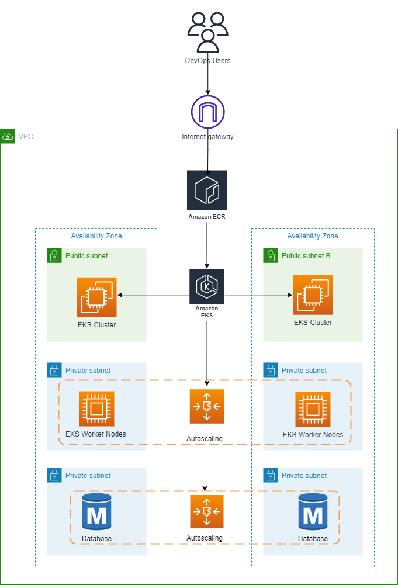
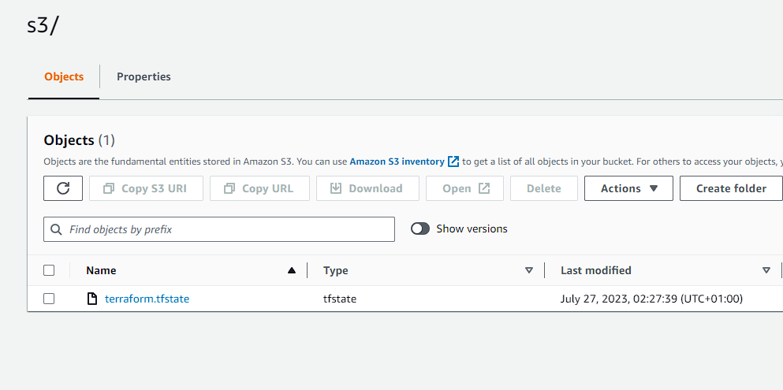
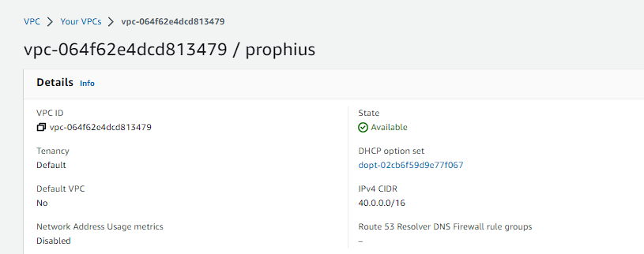

# EKS + ECR Deployment

In this project, I implemented an EKS (Elastic Kubernetes Search) cluster in AWS, with the addition of an ECR (Elastic Container Registry) and RDS instances running MySQL database. High availability is taken into consideration in this project to increase reliability of the cluster and the rest infrastructure. Additional steps (at my own discretion) are included to test the infrastructure if it was set up correctly. See infrastructure diagram below:



***Prerequisites***
*It is assumed that the user already possesses an AWS account and has these tools installed on their local machine: VS code (or any other IDE), Kubernetes CLI, Terraform & Docker*

*Also note that my comments and observations would be included at intervals during the project and not necessarily at the end. Enjoy the ride ;)*

**Step 1 - Create S3 Bucket To Host TF State File**
---

- Create a new file called `bucket.tf` and input the code block below:

```
# Create s3 bucket
resource "aws_s3_bucket" "prophius-bucket-aws" {
  bucket = "prophius-bucket"
  force_destroy = true
}

# Enable versioning on s3 bucket
resource "aws_s3_bucket_versioning" "version" {
  bucket = aws_s3_bucket.prophius-bucket-aws.id
  versioning_configuration {
    status = "Enabled"
  }
}

# Enable encryption for s3 bucket
resource "aws_s3_bucket_server_side_encryption_configuration" "first" {
  bucket = aws_s3_bucket.prophius-bucket-aws.id
  rule {
    apply_server_side_encryption_by_default {
      sse_algorithm = "AES256"
    }
  }
}
```

- Run `terraform init` to initialize terraform. After that, run `terraform apply` to start the bucket creation.

- Add the following code below to create create terraform locks using DynamoDB. *This helps to retain the integrity of the terraform state file when it has been deployed to the cloud to be worked on by a group of engineers.*

```
#Create dynamo DB for terraform locks
resource "aws_dynamodb_table" "prophius_locks_aws" {
  name         = "prophius-locks"
  billing_mode = "PAY_PER_REQUEST"
  hash_key     = "LockID"
  attribute {
    name = "LockID"
    type = "S"
  }
}
```

- Run `terraform apply` to run the configuration.

- Afrer the lock has been created, create a file called `backend.tf`. This will house the code where terraform is instructed to push the state file to the s3 bucket. *This came after the creation because Terraform expects that the bucket and other dependencies be set up before it pushes the state* Insert the code below:

```
# Push state file to cloud
terraform {
  backend "s3" {
    bucket         = "prophius-buck"
    key            = "prophius/s3/terraform.tfstate"
    region         = "us-east-1"
    dynamodb_table = "prophius-locks"
    encrypt        = true
  }
}
```



**Step 2 - Create VPC & Subnets**
---

*The VPC is the "house" that will host your subnets, instances, databases etc. It is a virtual network that resources in AWS need to be deployed in before they can communicate*

- Create a new file called `vpc.tf` and paste in the code below. The code will create the vpc and the public and private subnets:

```
# VPC Creation
resource "aws_vpc" "prophius" {
    cidr_block = var.vpc_cidr
    enable_dns_hostnames = true
    enable_dns_support = true
    tags = {
        Name = "prophius"
    }
}

# Create public subnets
resource "aws_subnet" "public" {
    count = var.preferred_number_of_public_subnets == null ? length(data.aws_availability_zones.available.names) : var.preferred_number_of_public_subnets
    vpc_id = aws_vpc.prophius.id
    cidr_block = "40.0.${count.index + 10}.0/24"
    map_public_ip_on_launch = true
    availability_zone = data.aws_availability_zones.available.names[count.index]

    tags = {
        Name = "publicSubnet${count.index + 1}"
    }
}

# Create private subnets
resource "aws_subnet" "private" {
    count = var.preferred_number_of_private_subnets == null ? length(data.aws_availability_zones.available.names) : var.preferred_number_of_private_subnets
    vpc_id = aws_vpc.prophius.id
    cidr_block = "40.0.${count.index + 20}.0/24"
    map_public_ip_on_launch = true
    availability_zone = data.aws_availability_zones.available.names[count.index]

    tags = {
       Name = "privateSubnet${count.index + 1}"
    }
}
```

- Create a new file called `output.tf`. This will be used to produce the outputs of the private and public subnets. Paste in the code below:

```
output "PublicIP" {
  value = ["${aws_subnet.public.*.id}"]
}

output "PrivateIP" {
  value = ["${aws_subnet.private.*.id}"]
}
```

*Notice what is happening here. When the subnets were being created, they were created as a tuple and not as a list, because they have more than one value within. The "value" line basically interpolates the output so it can produce the content of the tuple, as doing it the same way you would do a string would lead to an error*



**Step 3 - Create IGW & NAT Gateway**
---

*The internet gateway in this scenario is used to reach the EKS clusters over the internet. I took some extra steps which will be explained later and installed kubernetes on my local PC to manage the EKS clusters from the terminal without going to the AWS portal. An alternative can be used to achieve this and it is called VPC endpoints. However, I opted to using an internet gateway*

- Create a file called `igw.tf` and paste in the code below to create the internet gateway.

```
# Create IGW
resource "aws_internet_gateway" "ig" {
  vpc_id = aws_vpc.prophius.id

  tags = {
      Name = format("%s-%s-%s!", var.name, aws_vpc.prophius.id, "IG")
  }
}
```

- Create a new file called `nat-gw.tf`. The code below which will be pasted in the file creates an elastic IP which will be used by the EKS worker nodes to communicate with the cluster. Since the worker nodes are placed in a private subnet, they need a NAT gateway to reach the EKS clusters. See code below:

```
# Create EIP for NAT
resource "aws_eip" "nat_eip" {
    domain = "vpc"
    depends_on = [aws_internet_gateway.ig]

    tags = {
        Name = "NAT EIP"
    }
}

# Create NAT
resource "aws_nat_gateway" "nat" {
  allocation_id = aws_eip.nat_eip.id
  subnet_id = element(aws_subnet.public.*.id, 0)
  depends_on = [aws_internet_gateway.ig]

  tags = {
    Name = "NAT GW"
  }
}
```

**Step 4 - Configure Routes**
---

*Routes are basically what their name says they are. They are used to direct or "route" traffic between subnets and other resources*

- Create a new file called `routes.tf` that would hold the routing information to be configured. See code below:

```
# Create private route table
resource "aws_route_table" "privatertb" {
    vpc_id = aws_vpc.prophius.id

    tags = {
        Name = "Private Route Table"
    }
}

# Create public route table
resource "aws_route_table" "publicrtb" {
    vpc_id = aws_vpc.prophius.id

    tags = {
        Name = "Public Route Table"
    }
}

# Create route for the private route table
resource "aws_route" "privateroute" {
    route_table_id = aws_route_table.privatertb.id
    destination_cidr_block = "0.0.0.0/0"
    gateway_id = aws_nat_gateway.nat.id
}

# Create route for the public route table
resource "aws_route" "publicroute" {
    route_table_id = aws_route_table.publicrtb.id
    destination_cidr_block = "0.0.0.0/0"
    gateway_id = aws_internet_gateway.ig.id
}

# Associate the private route table with the private subnet
resource "aws_route_table_association" "privateasso" {
  count = length(aws_subnet.private[*].id)
  subnet_id = element(aws_subnet.private[*].id, count.index)
  route_table_id = aws_route_table.privatertb.id
}

# Associate the private route table with the private subnet
resource "aws_route_table_association" "publicasso" {
  count = length(aws_subnet.public[*].id)
  subnet_id = element(aws_subnet.public[*].id, count.index)
  route_table_id = aws_route_table.publicrtb.id
}
```

*Notice that the route tables were created first. The route tables hold the routing information that would be created. After, the routes themselves were created i.e the destination. Lastly, the route tables were attached to their respective subnets, which will be inherited by all resources placed within them.*

**Step 5 - Setup The Security Group**
---

- Run `touch SG.tf` to create a new file that will be responsible for the security group creation.

```
resource "aws_security_group" "eksMain" {
  name = "EKS Main"
  description = "EKS Controller Traffic"
  vpc_id = aws_vpc.prophius.id

  dynamic "ingress" {
    iterator = port
    for_each = var.inEKSmain
    content {
      from_port = port.value
      to_port = port.value
      protocol = "TCP"
      cidr_blocks = [var.vpc_cidr]
    }
  }

  dynamic "egress" {
    iterator = port
    for_each = var.outEKSmain
    content {
      from_port = port.value
      to_port = port.value
      protocol = "TCP"
      cidr_blocks = [var.vpc_cidr]
    }
  }

  tags = {
    Name = "eks Main"
  }
}

resource "aws_security_group" "eksNode" {
  name = "EKS Node"
  description = "EKS Node Traffic"
  vpc_id = aws_vpc.prophius.id

  dynamic "ingress" {
    iterator = port
    for_each = var.inEKSworker
    content {
      from_port = port.value
      to_port = port.value
      protocol = "TCP"
      cidr_blocks = [var.vpc_cidr]
    }
  }

  dynamic "egress" {
    iterator = port
    for_each = var.outEKSworker
    content {
      from_port = port.value
      to_port = port.value
      protocol = "TCP"
      cidr_blocks = [var.vpc_cidr]
    }
  }

  tags = {
    Name = "eks Node"
  }
}

resource "aws_security_group" "sqlSG" {
  name = "SQL"
  description = "SQL traffic"
  vpc_id = aws_vpc.prophius.id

  dynamic "ingress" {
    iterator = port
    for_each = var.inSQL
    content {
      from_port = port.value
      to_port = port.value
      protocol = "TCP"
      cidr_blocks = [var.vpc_cidr]
    }
  }

  dynamic "egress" {
    iterator = port
    for_each = var.outSQL
    content {
      from_port = port.value
      to_port = port.value
      protocol = "TCP"
      cidr_blocks = [var.vpc_cidr]
    }
  }

  tags = {
    Name = "sqlSG"
  }
}
```

*Notice that I didn't use the regular security group configuration that involves declaring the port values under "ingress" and "egress". I opted to use dynamic blocks as it makes the configuration look a lot cleaner and it also shows some level of understanding/experience with terraform. Details of how it works would be explained below*

- Create another file called `SGrules.tf`. Paste in the code below:

```
variable "inEKSmain" {
  type = list(number)
  default = [10250,6443,443,2379,2380]
}

variable "outEKSmain" {
    type = list(number)
    default = [10250,6443,443,2379,2380]
}

variable "inEKSworker" {
  type = list(number)
  default = [10250,6443,443,2379,2380]
}

variable "outEKSworker" {
    type = list(number)
    default = [10250,6443,443,2379,2380]
}

variable "inSQL" {
  type = list(number)
  default = [3306,22]
}

variable "outSQL" {
    type = list(number)
    default = [80,443,22,3306]
}
```

*This is where the magic happens. Notice in the `SGrules` file, variables are set and port numbers are declared in a numbered list. These values are now called in the `SG` file file when egress and ingress rules are to be set. This way, any resource can use an already predefined security goup without needing to redefine them. However for the sake of this demo, I created variables for EKSworker nodes to ease understanding but in reality, I may choose not to.*

**Step 6 - Create MySQL Database**
---

*Since there are more than one availability zones, the best way to approach this is to use the AWS RDS instance. It is a scalable database system. Kind of like EC2 but for databases. This is much easier compared to launching EC2 instances into their subnets and running a0 script on the machine to create the database or even using a launch template*

- Create a file called `rds.tf`.  Insert this code below into the file. It will create the MySQL database, assign it a DB name and create a user with a password.

```
# Create RDS
resource "aws_db_instance" "MySQL" {
  allocated_storage = 20
  storage_type = "gp2"
  engine = "mysql"
  engine_version = "5.7"
  instance_class = "db.t2.micro"
  db_name = "ProphiusDB"
  username = var.master-username
  password = var.master-password
  parameter_group_name = "default.mysql5.7"
  db_subnet_group_name = aws_db_subnet_group.prophius-subnet.name
  skip_final_snapshot = true
  vpc_security_group_ids = [aws_security_group.sqlSG.id]
  multi_az = "false"
}
```

- Insert this next line to the file. It would dictate what subnet the MySQL instance would be deployed to:

```
# Select what subnet would be used for deploymtn.
resource "aws_db_subnet_group" "prophius-subnet" {
  name = "prophius-subnet"
  subnet_ids = [aws_subnet.private[2].id, aws_subnet.private[3].id]
}
```

**Step 7 - Create EKS Cluster**
---

- Create a new file called `main.tf`. This would house the code to create the EKS cluster from terraform. Before that, paste in te following codes to get the list of availaibel AZs and select the cloud provider.

```
# Get list of AZ
data "aws_availability_zones" "available" {
  state = "available"
}

provider "aws" {
  region = var.region
}
```

- Now paste this code below in the same file:

```
# Create EKS cluster
resource "aws_eks_cluster" "ProphiusEKS" {
  name = "ProphiusEKS"
  role_arn = aws_iam_role.eks-iam-role.arn

  vpc_config {
    subnet_ids = [aws_subnet.public[0].id, aws_subnet.public[1].id]
  }

  depends_on = [ 
    aws_iam_role.eks-iam-role
   ]

  tags = {
    Name = "ProphiusEKSCLuster"
  }
}
```

*The code above creates the EKS cluster and is deployed into two public subnets. Notice there is a dependency argument present in the code. It will be sorted below.*

- Create a new file called `IAM-cluster.tf`. This houses the policy that would be referenced by the EKS cluster to be able to work. Without these roles, the EKS cluster cannot work. See code below:

```
resource "aws_iam_role" "eks-iam-role" {
 name = "eks-iam-role"

 path = "/"

 assume_role_policy = <<EOF
{
 "Version": "2012-10-17",
 "Statement": [
  {
   "Effect": "Allow",
   "Principal": {
    "Service": "eks.amazonaws.com"
   },
   "Action": "sts:AssumeRole"
  }
 ]
}
EOF

}

resource "aws_iam_role_policy_attachment" "AmazonEKSClusterPolicy" {
 policy_arn = "arn:aws:iam::aws:policy/AmazonEKSClusterPolicy"
 role    = aws_iam_role.eks-iam-role.name
}
resource "aws_iam_role_policy_attachment" "AmazonEC2ContainerRegistryReadOnly-EKS" {
 policy_arn = "arn:aws:iam::aws:policy/AmazonEC2ContainerRegistryReadOnly"
 role    = aws_iam_role.eks-iam-role.name
}
```

*The `policy_attachment` resource is used to attach policies to the roles that we created. These policies set the "DOs" and "DONTs for the role*

**Step 8 - Create EKS Worker Nodes
---

- Since the main nodes/cluster has been created, it is time for the worker nodes. Paste in the code below inside the same `main.tf` file.

```
# Create EKS worker nodes
resource "aws_eks_node_group" "ProphiusNode" {
  cluster_name = aws_eks_cluster.ProphiusEKS.name
  node_group_name = "ProphiusEKSnodes"
  node_role_arn  = aws_iam_role.workernodes.arn
  subnet_ids = [aws_subnet.private[0].id, aws_subnet.private[1].id]
  instance_types = ["t2.micro"]

  scaling_config {
    desired_size = 1
    max_size = 2
    min_size = 1
  }

  depends_on = [
   aws_iam_role_policy_attachment.AmazonEKSWorkerNodePolicy,
   aws_iam_role_policy_attachment.AmazonEKS_CNI_Policy
  ]
}
```

*These nodes are placed in the private subnet as they are not placed in the public subnet with the cluster. The instances are setup to go up to 2 max. There is also a dependency on some of the policies that are needed for the EKS worker nodes to work properly.*

- Create a file called `IAM-cluster.tf`. Like the `IAM-node`, this holds the policy and role necessary for the worker nodes to work. Paste the code below in the file:

```
resource "aws_iam_role" "workernodes" {
  name = "eks-node-group-example"
 
  assume_role_policy = jsonencode({
   Statement = [{
    Action = "sts:AssumeRole"
    Effect = "Allow"
    Principal = {
     Service = "ec2.amazonaws.com"
    }
   }]
   Version = "2012-10-17"
  })
 }
 
 resource "aws_iam_role_policy_attachment" "AmazonEKSWorkerNodePolicy" {
  policy_arn = "arn:aws:iam::aws:policy/AmazonEKSWorkerNodePolicy"
  role    = aws_iam_role.workernodes.name
 }
 
 resource "aws_iam_role_policy_attachment" "AmazonEKS_CNI_Policy" {
  policy_arn = "arn:aws:iam::aws:policy/AmazonEKS_CNI_Policy"
  role    = aws_iam_role.workernodes.name
 }
 
 resource "aws_iam_role_policy_attachment" "EC2InstanceProfileForImageBuilderECRContainerBuilds" {
  policy_arn = "arn:aws:iam::aws:policy/EC2InstanceProfileForImageBuilderECRContainerBuilds"
  role    = aws_iam_role.workernodes.name
 }
 
 resource "aws_iam_role_policy_attachment" "AmazonEC2ContainerRegistryReadOnly" {
  policy_arn = "arn:aws:iam::aws:policy/AmazonEC2ContainerRegistryReadOnly"
  role    = aws_iam_role.workernodes.name
 }
```

*As seen above, four policies were attached to the worker nodes role. These are necessities to make the worker nodes work*
